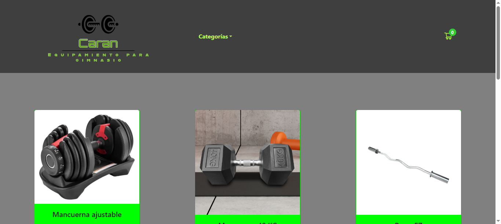
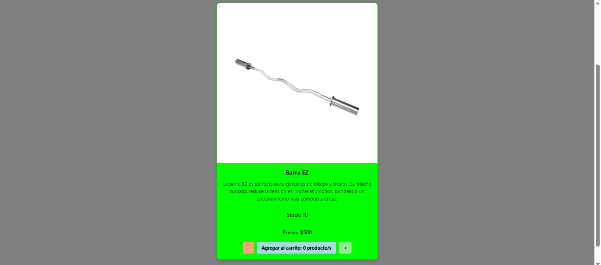
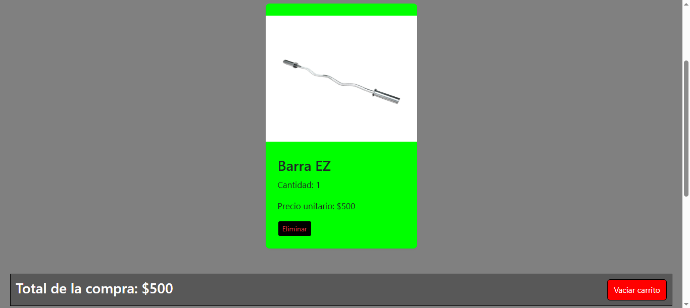
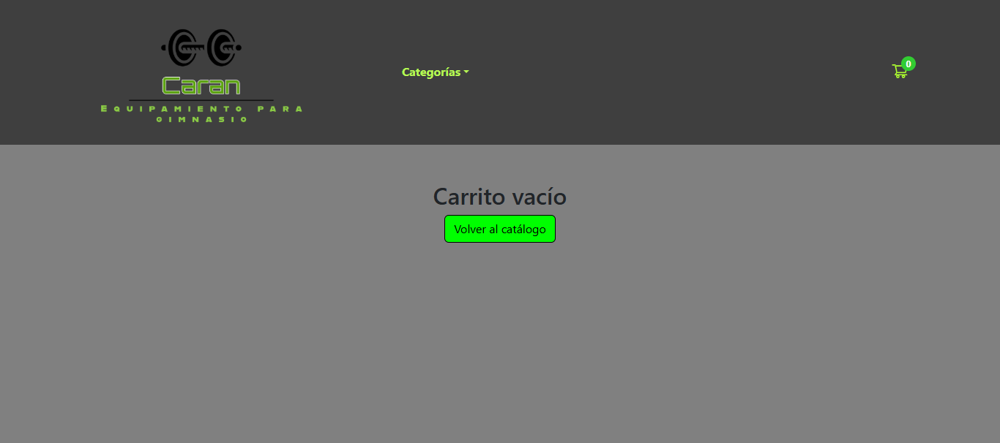

# Gym Equipment E-commerce

This is a fictional e-commerce web application built with **React + Vite**, simulating an online store for a gym equipment company. The project focuses on frontend development using modern UI libraries and integrates **Firebase** for backend services like data storage and order management.

## Technologies Used

- **React** (with Vite)
- **PrimeReact**
- **React Bootstrap**
- **Ant Design (Antd)**
- **Firebase** (Firestore)

## Firebase Integration

- Product and order data are stored in **Cloud Firestore**.
- Supports real-time updates and data persistence.
- Firebase is used as a lightweight backend solution.

## Project Structure

The project follows a clear component-based architecture:

- **Container Components**: Handle logic, Firebase interactions, and state management.
- **Presentational Components**: Focus solely on UI rendering and layout.

This separation ensures better code organization and reusability.

## Features

- Product listing with detailed views.
- Shopping cart functionality.
- Order creation and submission to Firebase.
- Firebase Firestore integration for real-time product and order management.

## Installation

To run this project locally:

```bash
# Clone the repository
git clone https://github.com/nehuis/React-Vite.git

# Navigate into the project folder
cd React-Vite

# Install dependencies
npm install

# Run the development server
npm run dev
```

## Screenshots

### Home page



### Product detail



### Cart



To complete the purchase and generate the order, you have to complete the form that is in the cart


If the cart is empty, there will be a message that indicates that and a button that takes you to the home page



This project is for educational purposes only and is not intended for production **use**
